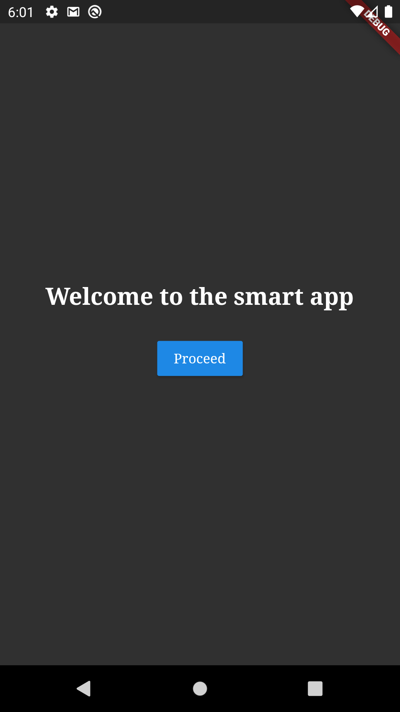
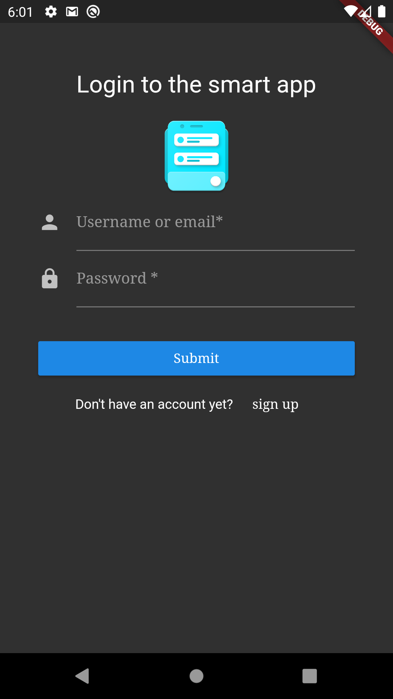
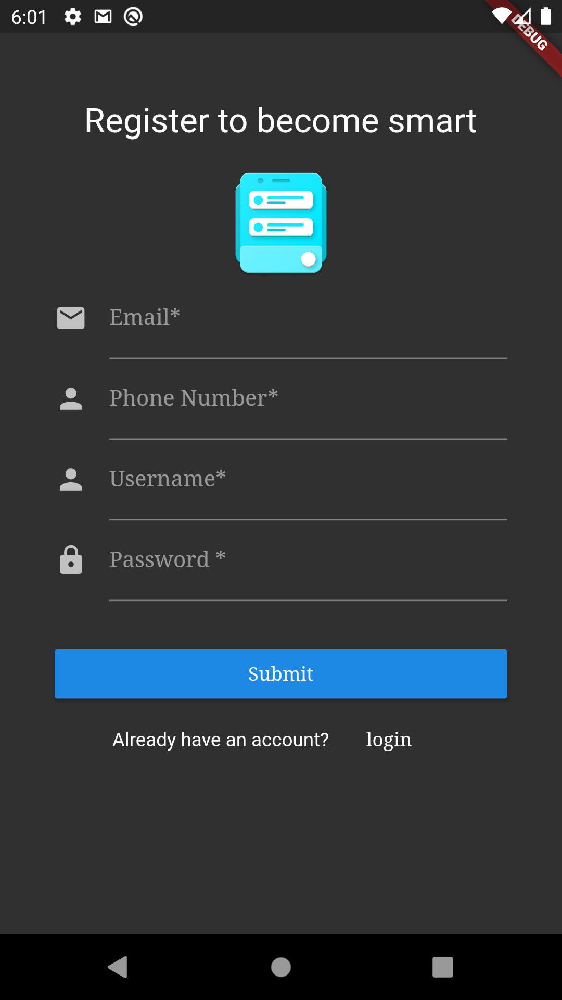

# SmartApp
The second task of the startng2020 flutter track

Smartapp has the following screens

1. Welcome page
2. Login page
3. Signup page


## Screenshots
Here are the screenshots of the compiled app

<div style = "diplay: flex;">
  <div>
    <h3>Welome Page</h3>
    
  </div>
  <div>
    <h3>Login Page</h3>
    
  </div>
  <div>
    <h3>Signup Page</h3>
    
  </div>
</div>

## Local Development
To run this project locally, you need to download the zip file and replace 
1. lib folder
2. Assets folder
3. pubspec.yml

in an existing flutter application

Or just clone the repo and run
```shell
flutter run
```